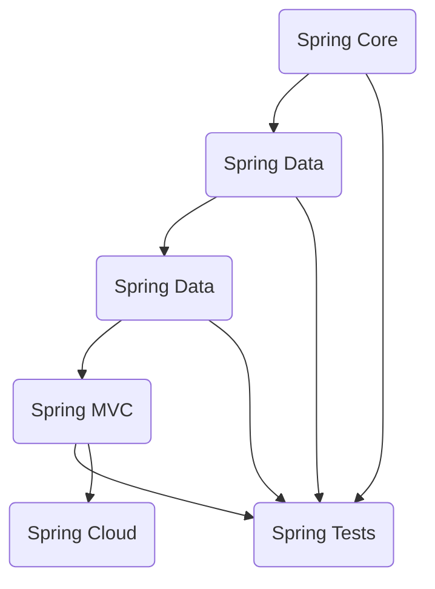

# 10 Week Plan

## Time Schedule

I have calculated that I have 42 hours every week to spend on study, projects, personal tasks, etc.

In this [document](TimeSchedule.md) there are the details about how I obtained this number of hours.

## Sprint Goals

### Sprint 1

1. Create a backlog for the following 10 weeks:
   - Create a backlog on [Taiga](https://taiga.io/).
   - Create tasks and assign priority.
2. Java:
   - Spring Core.
   - [Java Programming II](https://java-programming.mooc.fi/) Part 8 and 9.

### Sprint 2

1. Review backlog
   - Change the backlog and see if I can achieve my goals.
   - Change planning if needed.
2. Search for team members.
   - Ask classmates whether they are interested or not.
   - Decide roles to obtain a cross-functional team.
3. Java:
   - ~~Spring Data JDBC and MongoDB~~
   - Spring MVC
   - Java Programming II Part 10 and 11.
4. Design patterns

### Sprint 3

1. Research project ideas with the team:
   - Schedule meetings.
   - Write a document with ideas.
2. Java:
   - ~~Spring MVC.~~
   - Spring Data JDBC and MongoDB
   - Java Programming II Part 12 and 13.
3. Design patterns.

### Sprint 4

1. Choose a project idea.
   - Check if it is doable by the team.
   - Decide architecture for the project.
2. Java:
   - Spring + testing.
   - Java Programming II Part 14.
3. Architecture principles and patterns.

### Sprint 5

1. Project planning:
   - Create a backlog.
   - Create user stories.
2. Java:
   - Spring Cloud.

## Planning Table

| Sprint | Start Date |  End Date  | Sprint Goal             |
| :----: | :--------: | :--------: | :---------------------- |
|   1    | 2025-01-06 | 2025-01-19 | Initial Setup           |
|   2    | 2025-01-20 | 2025-02-02 | Team Formation          |
|   3    | 2025-02-03 | 2025-02-16 | Get ideas for a project |
|   4    | 2025-02-17 | 2025-03-02 | Decide a project idea   |
|   5    | 2025-03-03 | 2025-03-16 | Project Planning        |

## Roadmap

### Sprint 1:

- **Key milestones**:
  1. Backlog creation.
  2. Introduction to Spring Core.
- **Major Deliverables**:
  1. A clear backlog for the following 10 weeks.
  2. A small application that uses Spring Core features.
- **Completion date**:
  1. 2025-01-08
  2. 2025-01-19

### Sprint 2:

- **Key milestones**:
  1. Team formation.
  2. Study design patterns.
  3. Introduction to Spring Data.
- **Major Deliverables**:
  1. Team members selected.
  2. Implement key design patterns in code.
  3. Two applications with CRUD operations, one for JDBC and the other for MongoDB.
- **Completion date**:
  1. 2025-01-29
  2. 2025-02-02
  3. 2025-02-02

### Sprint 3:

- **Key milestones**:
  1. Get ideas for a project.
  2. Introduction to Spring MVC.
- **Deliverables**:
  1. A document with 2 o 3 ideas to work on.
  2. Create an application using Spring MVC.
- **Completion date**:
  1. 2025-02-12
  2. 2025-02-16

### Sprint 4:

- **Key milestones**:
  1. Select a project.
  2. Introduction to testing with Spring.
  3. Review architecture principles and main patterns.
- **Major Deliverables**:
  1. A document with the description of the project and its architecture.
  2. Functional tests for some of the previous applications.
  3. Notes of architecture principles and patterns.
- **Completion date**:
  1. 2025-03-26
  2. 2025-03-02
  3. 2025-02-02

### Sprint 5:

- **Key milestones**:
  1. Team project planning.
  2. Introduction to Spring Cloud.
- **Major Deliverables**:
  1. A product backlog for the project with user stories.
  2. A small microservice application.
- **Completion date**:
  1. 2025-03-12
  2. 2025-03-16

### Java Spring Roadmap

